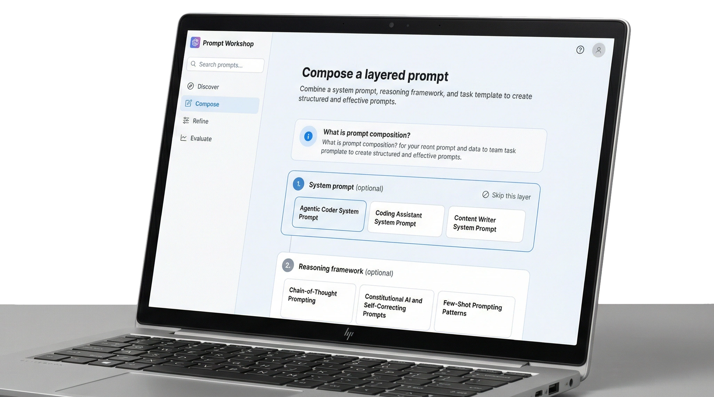
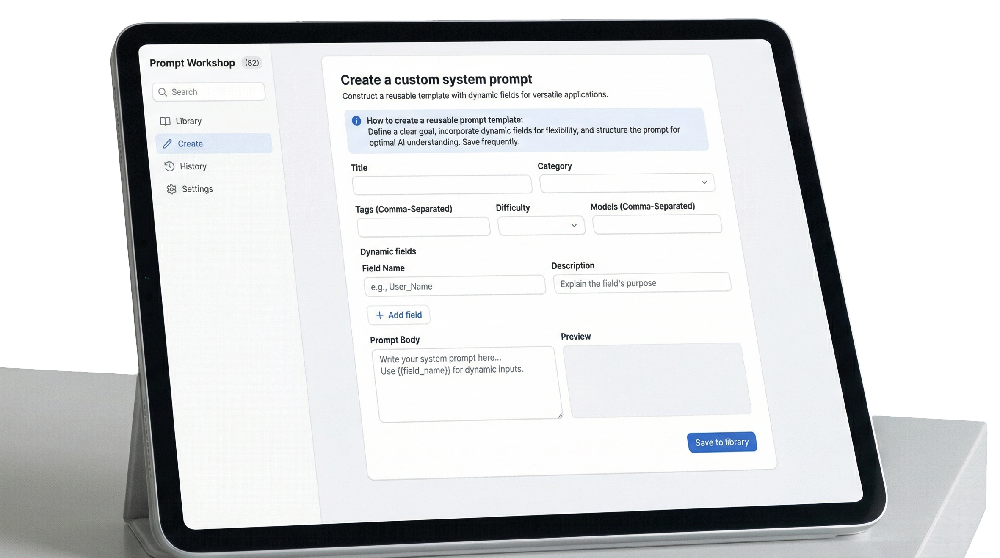
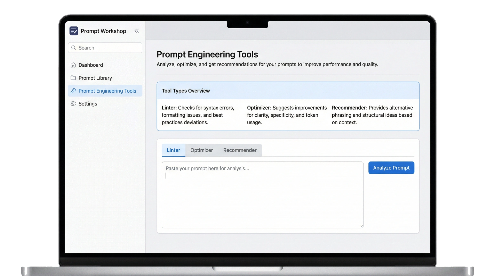
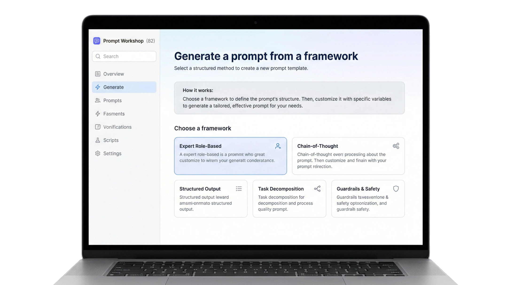

# ⚙️ The Prompt Engineering Toolbox: search, compose, create, lint, optimize, save and share your prompts and system prompts

<div align="center">
  
[](https://dishine.it/)

***Transform. Automate. Shine!***

[](https://dishine.it/blog/ai-prompt-library-templates/)
[](https://linkedin.com/company/100682596)
[]()
[](LICENSE)

<p align="center">
  
</p>

***82+ expert-level prompt templates, a prompt and system prompt workshop, and everything to search, browse, compose, create, lint, optimize and battle-test prompts across AI models.***

# 🚀 New exclusive home — [prompt.dishine.it](https://prompt.dishine.it/)

> 🌐 **The Prompt Workshop now lives *only* on the web, at [prompt.dishine.it](https://prompt.dishine.it/), and it has been substantially upgraded beyond the version shipped in this repository:**
>
> - 🧠 **Many more AI models** — broader multi-provider coverage, kept up to date as new models ship
> - ⚔️ **Live Battle & [Leaderboard](https://prompt.dishine.it/wiki/leaderboard)** — send the same prompt to multiple models and watch community rankings update in real time
> - 🔐 **[Private accounts & private chat](https://prompt.dishine.it/wiki/accounts-and-chat)** — sign in to sync your prompt library across devices and have account-scoped conversations
> - 💬 **AI chat with files & memory** — upload documents, attach context, and keep persistent memory across sessions
> - 🌍 **Trilingual** (EN · IT · FR) with an integrated [wiki](https://prompt.dishine.it/wiki)
>
> **What this means for this repository** — the **CLI**, the **Desktop apps** (macOS / Linux / Windows) and **`viewer.html`** are **frozen at v2.4.0 and are no longer maintained**. They remain in the repo for reference, historical builds, and forks, but **no new features or bug fixes will ship to them** — please use [prompt.dishine.it](https://prompt.dishine.it/) going forward. The prompt templates under [`prompts/`](prompts/) remain the source-of-truth library and continue to be accepted via pull request; the website consumes them directly. The repo stays open as the collaboration space for **issues, prompt contributions, forks, and discussion**.

Built by [diShine Digital Agency](https://dishine.it). Read more on the [diShine blog](https://dishine.it/blog/ai-prompt-library-templates/).

</div>

<p align="center">
  
  
</p>

If you work with LLMs regularly, you've probably got prompts scattered across Notion docs, Slack messages, and random text files. This library brings them together: organized, searchable, and ready to use.

<p align="center">
  
</p>

---

## Documentation

- **[README.md](README.md)** — this file, overview and quick start
- **[GUIDE.md](GUIDE.md)** — detailed user guide with examples
- **[FUNCTIONS.md](FUNCTIONS.md)** — detailed reference for every tool (linter, optimizer, recommender, generator, playground, etc.)
- **[INFRASTRUCTURE.md](INFRASTRUCTURE.md)** — algorithms, scoring math, and engine internals (technical & non-technical)
- **[TECHNICAL.md](TECHNICAL.md)** — architecture, module reference, data formats, extension guide
- **[CHANGELOG.md](CHANGELOG.md)** — version history and release notes
- **[desktop/README.md](desktop/README.md)** — desktop app build and install guides
- **[Wiki](https://github.com/diShine-digital-agency/ai-prompt-library/wiki)** — comprehensive trilingual wiki (English, Italian, French) with 33 pages covering every aspect of the tool
- **[CONTRIBUTING.md](CONTRIBUTING.md)** — how to contribute

---

**Which version should you use?**

| Version | Status | When to use |
|---------|--------|-------------|
| 🌐 **[prompt.dishine.it](https://prompt.dishine.it/)** (web) | ✅ **Actively maintained — canonical** | This is the version you should use. Live Battle & Leaderboard, private accounts, private chat, AI chat with files & memory, more models, trilingual wiki. |
| 🕸️ **`viewer.html`** (browser, offline) | ⚠️ **Legacy — frozen at v2.4.0** | Reference / offline fallback. Missing every feature listed above. |
| 🖥️ **Desktop apps** (macOS / Linux / Windows) | ⚠️ **Legacy — frozen at v2.4.0, no longer maintained** | Reference only. Build scripts kept for forks. See [`desktop/README.md`](desktop/README.md). |
| 🧰 **CLI** (`prompt-lib`) | ⚠️ **Legacy — frozen at v2.4.0** | Reference only. Terminal workflows that wrap the `prompts/` library still work. No new features. |
| 📚 **[`prompts/`](prompts/) library** | ✅ **Actively maintained** | The 82+ Markdown templates. Source-of-truth — consumed by the website. PRs welcome. |

Zero npm dependencies. Just Node.js built-in modules (for the legacy surfaces).

Built by [diShine](https://dishine.it)

---

## ⚡ Prompt Workshop (viewer.html) — *legacy, frozen at v2.4.0*

> ⚠️ **This section describes the legacy offline HTML viewer.** For the up-to-date Prompt Workshop — with Live Battle, leaderboard, private accounts, private chat, AI chat with files and memory, and many more models — go to **[prompt.dishine.it](https://prompt.dishine.it/)**. The `viewer.html` file is no longer maintained.

The legacy **Prompt Workshop** is a standalone HTML file — no server, no build step, no internet required. Just open `viewer.html` in any browser and you get the prompt library with an interactive interface (at the v2.4.0 feature set).

### What it does

| Tab | Description |
|-----|-------------|
| **Browse** | Search and filter all 82+ prompts by category, difficulty, model, or keyword. Click any prompt to read the full content, copy it, or build it interactively. |
| **Compose** | Build layered prompts by combining a **system prompt** (persona) + **reasoning framework** (technique) + **task template** (the work). All three combine into one powerful prompt. |
| **Create** | Build your own custom prompts with dynamic `{{field_name}}` placeholders. Choose from 6 starter templates (Expert Assistant, Content Writer, Code Generator, Data Analyst, Marketing Strategist, Image Prompt) or start from scratch. Define fields, write the body, and save to your personal library. |
| **Generate** | Pick a proven framework, answer guided questions, and get a production-ready system prompt generated automatically — no prompt engineering experience needed. |
| **Tools** | **Prompt Linter** (14-rule quality analysis with 0–100 scoring, auto-detects prompt type — image/code/system/general — and adjusts rule weights), **Prompt Optimizer** (content-aware rewriting with diff view — detects your domain, replaces vague language, strengthens weak verbs, removes filler, adds domain-specific role/constraints/output format/quality checks + optional AI-powered rewriting), and **Smart Recommender** (describe your use case, get personalized prompt suggestions with a recommended system prompt + framework + template combo). See [FUNCTIONS.md](FUNCTIONS.md) for full details. |
| **Playground** | Send prompts directly to AI models (OpenAI GPT, Anthropic Claude, Google Gemini). Add a system prompt, see responses, track token usage — iterate without leaving the tool. **Multi-Model Compare**: configure 2+ API keys, then click "⚖ Compare" to send the same prompt to all providers at once and see responses side-by-side with timing and token stats. |
| **My Library** | All your saved prompts, filled templates, and compositions with search, type filter, and sort controls. Stored in your browser's localStorage — persists across sessions. |

### Quick Fill & Compose

Many prompts include `{{field_name}}` placeholders. When you open one, you'll see a **⚡ Quick Fill** button that gives you a streamlined experience:

1. **Only the fields appear** — no distraction, just the inputs you need to fill
2. **Field descriptions** tell you exactly what each placeholder expects
3. **Live preview** updates as you type — see the assembled prompt in real time
4. **Progress bar** tracks how many fields you've completed
5. **One-click copy** — paste the filled prompt directly into your AI tool

This is the fastest way to use templates from the library. No prompt engineering knowledge required.

### Keyboard shortcuts

| Key | Action |
|-----|--------|
| `1`–`7` | Switch between tabs (Browse, Compose, Create, Generate, Tools, Playground, My Library) |
| `Ctrl+K` | Focus the search box |
| `H` | Toggle beginner help tips on/off |
| `D` | Toggle dark mode |
| `Esc` | Clear search |

### Beginner mode

Click the **?** button (top-right) to toggle beginner help tips. When enabled, each tab shows contextual guidance explaining what the feature does, how to use it, and pro tips for better results. Perfect for people new to prompt engineering.

### API Settings (⚙)

Click the **⚙** button (top-right) to configure API keys for OpenAI, Anthropic, and Google. Keys are stored locally in your browser — never sent anywhere except the API provider. Required for the Playground and AI-powered optimization.

---

## What's in here

82+ prompts across 8 categories:

| Category | Count | What's covered |
|----------|-------|----------------|
| **frameworks** | 12 | Chain-of-Thought, Few-Shot, ReAct, Tree-of-Thought, Role-Based, Meta-prompting, Constitutional AI, Prompt Chaining, Structured Extraction, Mega-Prompt, Prompt Evaluation, Self-Consistency |
| **model-specific** | 6 | deep technique guides for Claude, GPT, Gemini, Llama, Mistral, plus a side-by-side comparison |
| **system-prompts** | 10 | production-ready system prompts for coding, writing, data analysis, research, executive advisor, support, technical writer, agentic coder, deep researcher, Socratic tutor |
| **marketing** | 11 | SEO briefs, email campaigns, social calendars, competitor analysis, ad copy, brand voice, conversion copywriting, LinkedIn content, landing page copy, product descriptions, growth experiments |
| **development** | 13 | code review, API design, database schema, testing, refactoring, architecture decisions, prompt-as-code, debugging, code documentation, git commits, code refactoring review, incident response, system design |
| **data** | 10 | SQL builder, data pipelines, dashboards, quality audits, statistics, visualization, ETL automation, data cleaning, report generation, ML model evaluation |
| **business** | 12 | proposals, meeting summaries, OKRs, stakeholder updates, risk assessment, pitch decks, client communication, competitive intelligence, executive summaries, job descriptions, sales battlecards, investor pitches |
| **image-generation** | 8 | product photography, portraits, social media visuals, infographics, character design, logo & branding, cinematic scenes, art style transfer |
| **custom** | ∞ | your own prompts created with `create` or `generate` |

These aren't generic "write me a blog post" prompts. They're structured templates with placeholders, examples, tips, and common mistakes -- the kind of thing you'd build up over months of actual use.

---

## Quick start

> ✅ **Recommended:** open **[prompt.dishine.it](https://prompt.dishine.it/)** — nothing to install, all new features included.
>
> The commands below are for the **legacy, unmaintained** local surfaces (kept for reference and forks).

```bash
# Legacy CLI (frozen at v2.4.0) — clone and run directly, no npm install needed
git clone https://github.com/diShine-digital-agency/ai-prompt-library.git
cd ai-prompt-library
node bin/prompt-lib.js list

# Or install the legacy CLI globally
npm install -g @dishine/prompt-library
prompt-lib list

# Or just open the legacy browser app — no Node.js required
# Open viewer.html in any browser
```

---

## CLI usage — *legacy, frozen at v2.4.0*

```bash
# List all prompts grouped by category
prompt-lib list

# Search prompts by keyword
prompt-lib search "chain of thought"
prompt-lib search "marketing email"

# Show full prompt content
prompt-lib show chain-of-thought
prompt-lib show code-review

# Build a prompt interactively — fills in {{placeholders}} for you
prompt-lib use chain-of-thought

# Copy a prompt template to clipboard
prompt-lib copy email-campaign

# Combine a system prompt + framework + domain template into one prompt
prompt-lib compose

# Create a custom system prompt with dynamic fields
prompt-lib create

# Generate a prompt from a framework (answer questions, get a prompt)
prompt-lib generate

# View saved compositions and custom prompts
prompt-lib saved

# Analyze a prompt for quality issues (0-100 score, A-F grade)
prompt-lib lint

# Rewrite a prompt with best practices (rule-based, offline)
prompt-lib optimize

# Get smart prompt suggestions for your use case
prompt-lib recommend "write marketing copy for a SaaS landing page"

# Open the Prompt Workshop in your default browser
prompt-lib viewer

# List all categories with counts
prompt-lib categories

# Show a random prompt (good for discovering things you forgot were in here)
prompt-lib random

# Library statistics
prompt-lib stats

# Help and version
prompt-lib --help
prompt-lib --version
```

---

> See [CHANGELOG.md](CHANGELOG.md) for the full version history.

---

## Prompt format

Every prompt file uses YAML frontmatter with Markdown content:

```markdown
---
title: Chain-of-Thought Prompting
category: frameworks
tags: [reasoning, step-by-step, problem-solving]
difficulty: intermediate
models: [claude, gpt-4, gemini, llama, mistral]
---

# Chain-of-Thought Prompting

[Content with sections: When to Use, The Technique, Template, Examples, Tips, Common Mistakes]
```

### Metadata fields

| Field | Description |
|-------|-------------|
| `title` | human-readable name |
| `category` | one of the categories listed above |
| `tags` | searchable keywords |
| `difficulty` | `beginner`, `intermediate`, or `advanced` |
| `models` | which LLMs this technique works best with |

---

## Programmatic usage

```javascript
import { loadPrompts, findPlaceholders, extractTemplate } from '@dishine/prompt-library';
import { searchPrompts } from '@dishine/prompt-library/src/search.js';
import { generatePrompt, getFrameworks } from '@dishine/prompt-library/src/generator.js';

const prompts = loadPrompts();
const results = searchPrompts(prompts, 'code review');

console.log(results[0].title);   // "Code Review Prompt"
console.log(results[0].content); // full prompt content

// Generate a prompt from a framework
const prompt = generatePrompt('expert-role', {
  role: 'data analyst',
  domain: 'business intelligence',
  task: 'Build SQL queries from natural language',
});
```

---

## Adding your own prompts

The library is designed to be extended. To add a prompt:

1. Create a `.md` file in the appropriate `prompts/` subdirectory
2. Add YAML frontmatter with `title`, `category`, `tags`, `difficulty`, `models`
3. Structure the content with these sections:
   - **When to use** -- when this technique applies
   - **The technique** -- detailed explanation
   - **Template** -- copy-paste ready template with `{{placeholders}}`
   - **Examples** -- real-world usage examples
   - **Tips** -- expert advice from actual use
   - **Common mistakes** -- pitfalls to avoid

The CLI picks up new files automatically -- no registration step.

Or use `prompt-lib create` to build prompts interactively and save them to your personal library.

---

## Project structure

```
ai-prompt-library/
  bin/prompt-lib.js        CLI entry point
  src/
    index.js               prompt loader, persistence, shared utilities
    search.js              scored search (title/tag/category/content)
    formatter.js           ANSI terminal formatting
    generator.js           dynamic prompt generation from frameworks
    linter.js              14-rule prompt quality scorer
    optimizer.js           content-aware prompt optimizer (domain detection, vague language fix, etc.)
    recommender.js         intent-based prompt matcher
  prompts/
    frameworks/            core prompting techniques
    model-specific/        model-optimized patterns
    system-prompts/        production system prompts
    marketing/             marketing templates
    development/           development templates
    data/                  data & analytics templates
    business/              business templates
    image-generation/      image & visual AI prompt templates
  desktop/
    build-all.sh           cross-platform build (macOS + Linux + Windows)
    build-macos.sh         macOS native app build (Swift on Mac, browser fallback on Linux)
    build-linux.sh         Linux .desktop build script (GTK + WebKitGTK)
    build-windows.bat      Windows build script (Edge app mode)
    macos-native/          Swift source for native macOS app
    linux-native/          Python GTK source for native Linux app
    icons/                 App icons for all platforms (.icns, .png, .ico)
    README.md              install guides, troubleshooting, platform notes
  viewer.html              interactive Prompt Workshop (standalone, works offline)
  test/run.js              test suite
  CHANGELOG.md             version history
  CONTRIBUTING.md          how to contribute
  FUNCTIONS.md             detailed tool and function reference
  GUIDE.md                 user guide with examples
  TECHNICAL.md             architecture and technical documentation
```

---

## Desktop & Mobile Apps — *legacy, frozen at v2.4.0*

> ⚠️ **The desktop apps (macOS / Linux / Windows) are no longer maintained.**
> Use **[prompt.dishine.it](https://prompt.dishine.it/)** on any desktop browser instead — it supports "Add to Dock / Home Screen" on every major OS (macOS, Windows, Linux, iOS, Android), includes every new feature (Live Battle & Leaderboard, private accounts, private chat, AI chat with files & memory, more models), and is kept up to date.
>
> The build scripts below are retained in the repo for reference, historical builds, and forks. They still produce working v2.4.0 apps, but will not receive further updates — see [`desktop/README.md`](desktop/README.md) for details.

The legacy Prompt Workshop ran as a **native application** on all desktop platforms — each with its own window, app icon, and one-click installer. No terminal needed after building.

Desktop apps are built from source (no pre-built downloads). You need Node.js 18+ and Bash:

```bash
# Clone and build for all platforms
git clone https://github.com/diShine-digital-agency/ai-prompt-library.git
cd ai-prompt-library
./desktop/build-all.sh
```

| Platform | How to install |
|----------|----------------|
| **macOS** (built on Mac) | Build → move `dist/PromptWorkshop.app` to Applications. Native Swift app, runs in its own window. Requires Xcode Command Line Tools (`xcode-select --install`). |
| **macOS** (built on Linux) | Build → move `dist/PromptWorkshop.app` to Applications. Opens in browser (no native window). |
| **Linux** | Build → extract `dist/prompt-workshop-linux.tar.gz` → double-click `install.sh`. Native GTK window on most desktops (Ubuntu, Fedora, Mint), falls back to browser. |
| **Windows** | Build → extract `dist/PromptWorkshop-win.zip` → double-click `Install.bat`. Opens in Edge app mode (own window), falls back to Chrome or browser. |
| **Android / iOS** | Open `viewer.html` in browser → "Add to Home Screen" |

All three desktop apps run in their **own window** (no browser chrome) with custom app icons, keyboard shortcuts, and persistent storage. See [`desktop/README.md`](desktop/README.md) for detailed step-by-step instructions and troubleshooting.

---

## Platform Notes

The CLI and browser app work on **macOS**, **Linux**, and **Windows**. Here are the platform-specific details:

| Feature | macOS | Linux | Windows |
|---------|-------|-------|---------|
| CLI commands | ✅ Full support | ✅ Full support | ✅ Full support |
| Clipboard (`copy`, `compose`) | ✅ Built-in (`pbcopy`) | ✅ Requires `xclip` or `xsel` | ✅ Built-in (`clip`) |
| `viewer` command | ✅ `open` | ✅ `xdg-open` | ✅ `start` |
| Browser app (`viewer.html`) | ✅ Any browser | ✅ Any browser | ✅ Any browser |
| Desktop app build | ✅ Native Swift app | ✅ GTK + WebKitGTK | ✅ Edge app mode |
| Build scripts (`.sh`) | ✅ Bash built-in | ✅ Bash built-in | ⚠️ Requires Git Bash or WSL |

**Linux clipboard setup:** Install `xclip` (recommended) or `xsel` for clipboard commands to work. Without them, prompts are printed to the terminal for manual copying.

```bash
# Ubuntu / Debian
sudo apt install xclip

# Fedora
sudo dnf install xclip
```

See [GUIDE.md — Troubleshooting](GUIDE.md#troubleshooting) for more platform-specific help.

---

## Requirements

- **Node.js** 18 or later
- No npm dependencies at all -- uses only Node.js built-in modules (`fs`, `path`, `url`, `readline`, `child_process`, `os`)

---

## License

MIT -- [diShine](https://dishine.it)

---

## About diShine

[diShine](https://dishine.it) is a creative tech agency based in Milan. We create digital strategies, design process and build tools for clients, help businesses with AI strategy and MarTech architecture, and open-source some things we wish existed.

- Web: [dishine.it](https://dishine.it)
- GitHub: [github.com/diShine-digital-agency](https://github.com/diShine-digital-agency)
- Contact: kevin@dishine.it

